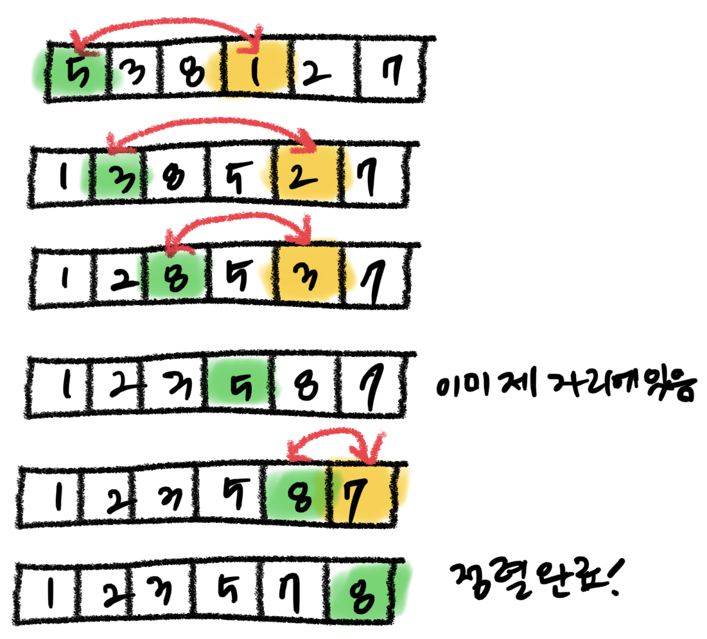

# 정렬

- [선택정렬](#선택정렬)
- [삽입정렬](#삽입정렬)


### 정렬 알고리즘 구분

- **단순하지만 비효율적인 방법**

  삽입 정렬, 선택 정렬, 버블 정렬 등

- **복잡하지만 효율적인 방법**

  퀵 정렬, 히프 정렬, 합병 정렬, 기술 정렬 등

- **안정성(stability)의 측면에서 구분하는 경우**

  정렬 알고리즘에서 안정성이란 입력 데이터에 동일한 키 값을 갖는 레코드가 여러 개 존재할 경우, 이들 레코드들의 상재거인 위치가 정렬 후에도 바뀌지 않음을 뜻한다. 

  정렬 알고리즘 중에서 안정성을 충족하는 것은 삽입정렬, 버블정렬, 머지정렬이 있다. 


## 선택정렬

선택 정렬(selection sort)입력 배열에서 최소값을 발견한 다음, 최소값을 배열의 첫번째 요소와 교환한다. 첫번째 요소를 제외한 나머지 요소들 중에서 가장 작은 값을 선택하고 이를 두번째 요소와 교환한다. 이를 (배열의 개수-1)만큼 되풀이하면 전체 숫자를 정렬할 수 있다. 



```python
test_list = [5, 3, 8, 1, 2, 7]
n = len(test_list)

def selection_sort(list, n):
    i = least = 0
    j = i + 1

    for i in range(n-1):
        least = i
        for j in range(i+1, n):
            if(list[j] < list[least]):
                least = j
        temp = list[i]
        list[i] = list[least]
        list[least] = temp
        # list[i], list[least] = list[least], list[i]

selection_sort(test_list, n)

print(test_list)
```

리스트의 첫번째 요소의 오른쪽에 있는 것에서 최소값을 발견한 다음 첫번째 요소와 교환한다.

첫번째 요소를 최소값으로 두고, (리스트의 크기 -1)만큼 교환을 시작한다. (리스트의 크기-1)만큼 하는 이유는 마지막은 이미 정렬이 완료된 상태로 교환할 필요가 없기 때문이다.

이제 교환하기 위해 첫번째 요소의 오른쪽에 있는 요소들을 i+1(비교하려는 숫자 오른쪽 시작점)부터 n(리스트의 크기)만큼 비교한다. 만약 비교하려는 숫자가 가장 최소인 것보다 작다면 최소값을 비교하는 숫자로 대입해준다. 


전체 비교 횟수는 아래와 같다. 

(n-1) + (n-2) + ... + 1 = n(n-1)/2 = O(n^2)

이동 횟수는 한번 교환하기 위해 temp=list[i], list[i] = list[least], list[least] = temp 총 3번 이동이 발생하므로 3(n-1)이 된다.


**장점**

자료 이동 횟수가 미리 결정된다.

**단점**

자료 이동 횟수가 3(n-1)로 상당히 큰 편이다. 자료가 정렬된 경우에 불필요하게 자신과의 이동을 한다. 안정성을 만족하지 않아 값이 같은 레코드가 있는 경우 상대적인 위치가 변경될 수 있다.


## 삽입 정렬

삽입 정렬(insertion sort)을 정렬되어 있는 리스트에 새로운 값을 적절한 위치에 삽입하는 과정을 반복한다. 선택 정렬과 마찬가지로 입력 배열을 선택 정렬과 유사하게 입력배열을 정렬된 부분과 정렬 되지 않은 부분으로 나누어서 사용한다. 

정렬되어 있지 않은 부분의 첫 번째 숫자가 정렬된 부분의 어느 위치에 삽입되어야 하는가를 판단하고 해당 위치에 숫자를 삽입하면, 정렬된 부분의 크기는 1 커지고, 정렬이 되지 않은 부분의 크기는 1 줄어든다. 이를 정렬되지 않은 부분이 빌 때까지 반복하여 전체 리스트를 정렬시킨다. 

`


> 삽입 정렬 알고리즘

```python
insertion_sort(A, n):
 
for i<-1 to n-1 do
	key<-A[i]
  j<-i-1;
  while j>= 0 and A[j]>key do
  	A[j+1]<-A[j];
    j<-i-1;
  A[j+1]<-key
```

1. 인덱스 1부터 시작한다. 인덱스 0은 이미 정렬된 것으로 본다.
2. 현재 삽입될 숫자인 i 번째 정수를 key 변수로 복사한다.
3. 현재 정렬된 배열은 i-1까지 이므로 i-1번째부터 역순으로 0번까지 조사한다.
4. j 값이 음수가 아니고, key값보다 정렬된 배열에 있는 값이 크면
5. j 번째를 j+1번째로 이동한다.
6. j를 하나 감소한다.
7. j번째 정수가 key보다 작으므로 j+1번째가 key값이 들어갈 위치이다.


```python
test_list = [5, 3, 8, 1, 2, 7]
n = len(test_list)

def insertion_sort(list, n):
    i = key = temp = 0
    j = i - 1

    for i in range(1, n):
        key = list[i]
        for j in range(i, 0, -1):
            if list[j-1] > key:
                temp = list[j-1]
                list[j-1] = key
                list[j] = temp
                # list[j-1], list[j] = list[j], list[j-1]
                
insertion_sort(test_list, n)

print(test_list)
```

삽입 정렬의 외부 루프는 n-1 번 실행되고 1번 비교와 2번의 이동만 이루어지므로 총 비교횟수는 n-1번, 총 이동횟수는 2(n-1)번이 된다. 알고리즘의 시간 복잡도는 O(n)이다. 

삽입 정렬은 레코드 양이 많고 크기가 클수록 적합하지 않다. 대신 레코드 대부분이 이미 정렬되어 있는 경우 효율적이다. 


## 버블 정렬

